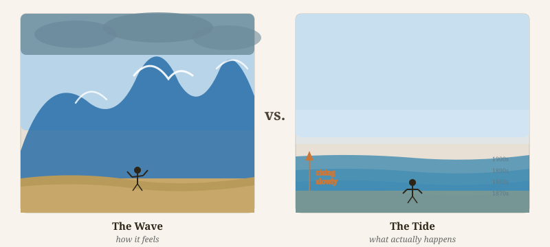
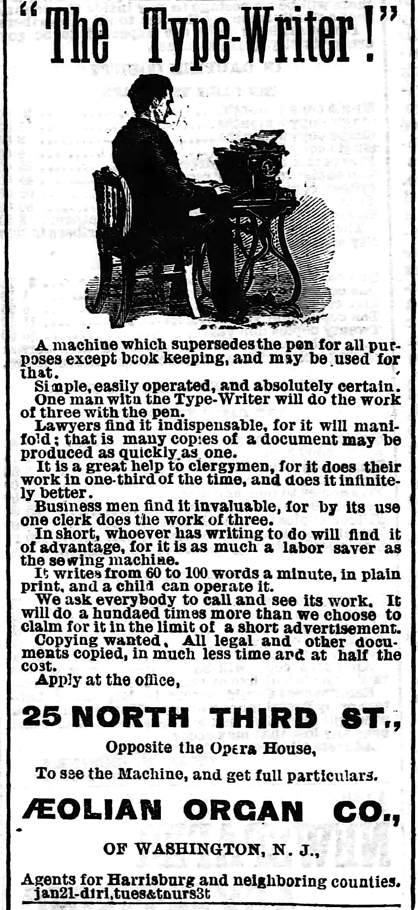
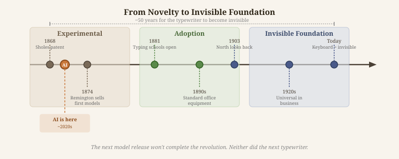
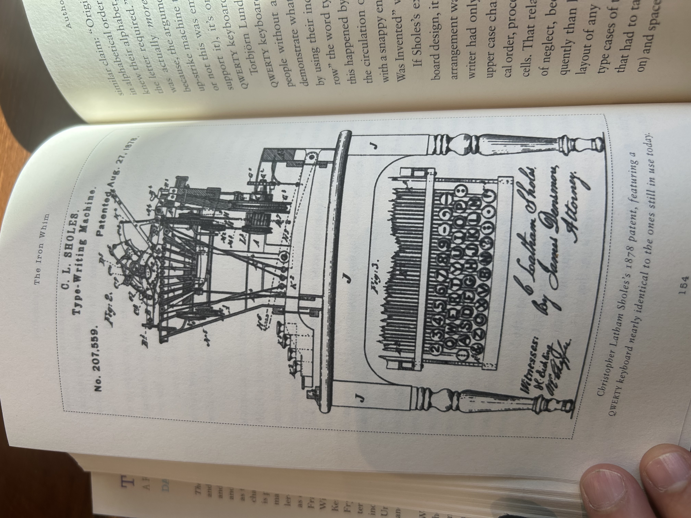

Software engineers have been given an impossible task in 2025: "automate your job with AI or be automated out of a job." You are being asked to surf a wave of tools that promise to fix all your bugs and generate your code. Paddle fast or you'll drown! Every day it feels like there are more new tools than you could even try out. Does work really change this quickly?

When the typewriter first entered the office one hundred fifty years ago, it also promised to transform work overnight. People reacted with the same mix of emotions that they do to AI today: fear of automation and curiosity about what might be possible with new tools.

Looking back, we can see that real adoption was gradual and people found ways to navigate the shift with poise and balance. By retracing their fears, their tinkering, and the evolution of the typewriter itself, we can steady ourselves too.

## Machines That Write?

It might be hard to look down at your keyboard today and feel threatened by what it could produce, but in the late 1800s that's exactly how some people reacted.

In one account of novelist George Eliot seeing her first typewriter, she ["immediately jumped to the conclusion that you could produce books in that way, and that all you had to do was to sit down and play on the typewriter, and books would tumble out at the other end."](https://type-writer.org/?p=6041) Before there was generative AI "slop", Eliot feared "typewriter slop".

In contrast, Mark Twain treated the new invention as something to play with. In his essay, [The First Writing Machines](https://americanliterature.com/author/mark-twain/short-story/the-first-writing-machines), Twain describes his early use of the typewriter as a toy, not meant for serious work. "At home I played with the toy…repeating…'The Boy stood on the Burning Deck,' until I could turn that boy's adventure out at the rate of twelve words a minute; then I resumed the pen, for business, and only worked the machine to astonish inquiring visitors."

We hear the same reactions today — artists and creators echoing Eliot's frustration on one side and Twain's quirky curiosity on the other.

Fear of being replaced and curiosity about new possibilities are normal reactions to tools that promise to change how we work. So what if the crashing wave is more like the tide, moving in and out between fear and curiosity as we slowly adapt?

## A Tide, Not A Wave

Like a tide gradually reshaping the shoreline, the typewriter took decades to change office work. Businesses had to invest in new equipment, workflows, and above all, training programs. Typing schools flourished. Whole new jobs emerged: secretaries, typists, stenographers.

In [The Introduction of the Sholes & Glidden Type-Writer, 1874](https://branchcollective.org/?ps_articles=christopher-keep-the-introduction-of-the-sholes-glidden-type-writer-1874), Christopher Keep describes how the typewriter changed roles over time. He says that clerical work was traditionally done by men "who demanded a wage sufficient to raise a family, and expected to rise in the ranks and become in due course managers or even partners in the firm. Female typists, by contrast, were willing to accept such work for half the wages that their male counterparts received." Despite this gender bias, or maybe because it still created favorable work opportunities, these roles quickly became associated with young women.

One wave of workers moved out, another moved in.

The pattern is the same: new technology arrives and doesn't fit any existing roles, so an opportunity emerges for someone who can use it. Later, the technology gets integrated and what was once a curious job becomes just another skill.

Today a "typist" isn't a distinct job role. Everyone can type. In the future, "prompt engineer" won't be a job either. We will prompt AI just like we type, rarely thinking about how work used to be done.

For now, though, new roles will keep appearing and new promises of greater productivity will entice us to switch tools.

## Every New Tool Promises to Save Time

Early typewriter ads promised big productivity gains too — "three times faster than handwriting." Business communication needed to happen at machine speeds to match the telegraph and railroads.

But when was the last time anyone compared typing speed to handwriting? Does any company advertise typing skills as a competitive advantage?

Typing is now the invisible foundation of digital work, not a productivity hack. Every new tool begins with a promise to save time, but in the end, it simply reshapes how we spend our time. AI productivity hype is going to fade too, and some future version of AI will become a new invisible foundation.

We aren't anywhere close to that. Each new model release sparks anxiety or excitement — a sign that these tools are still finding their place.

## We Are Still Early

We are still in the experimental phase of AI. The next new model will arrive dramatically, but it won't complete the AI revolution any more than typewriter prototypes of the 1860s resemble the typewriter you know today.

Early typewriter patents show us how clunky and haphazard innovation progress can be. There are machines you would barely recognize as a typewriter: circular keyboards, rotating paper feeds, even piano-like designs. Nobody knew which components would be part of the final design.

In 1903, Simon North, a director who brought typewriters into the Census Bureau, [wrote that he regretted not keeping early versions](https://type-writer.org/?p=7047): "…it would have illustrated better than any other mechanism with which I am familiar the marvelous rapidity with which American ingenuity advances to the point of perfecting any labor saving instrument."

North was describing 30 years of adoption and still felt impatient, just like you feel with every new AI release — "should I switch to a new IDE?", "do I need to start using background agents?", "will my old prompts work with this new model?".

On a 30-year timeline, AI development will stumble along just like the typewriter did, with curious benchmarks like the Will Smith Eating Spaghetti Test to track progress along the way.

We probably won't notice the shift to a stable AI foundation in real time. Some day, just like the keyboard, we will just take it for granted.

So how do we reconcile so much uncertainty with the pressure to keep up?

## Float Down the River of Innovation

Mark Twain found a balance through curiosity and play. At first, the typewriter was just a toy to him, something to show off to visitors. But he also watched the technology mature. ["At the beginning of that interval a type-machine was a curiosity. The person who owned one was a curiosity, too. But now it is the other way about: the person who doesn't own one is a curiosity."](https://americanliterature.com/author/mark-twain/short-story/the-first-writing-machines)

Over that 30-year shift from novelty to normal, Twain kept tinkering. He wrote silly letters. He experimented. By the end, he brags that *The Adventures of Tom Sawyer* was the very first novel to be composed on the typewriter. Play led to mastery.

Maybe we don't need to paddle faster than a crashing wave after all. Forget the productivity hype, relentless efficiency, and premature automation. Maybe, like Huckleberry Finn, you can float down the river of innovation.

---

*Sources: I leaned heavily on Christopher Keep's [essay on the Sholes & Glidden typewriter](https://branchcollective.org/?ps_articles=christopher-keep-the-introduction-of-the-sholes-glidden-type-writer-1874), the [Type-Writer.org](https://type-writer.org) archives, Mark Twain's [The First Writing Machines](https://americanliterature.com/author/mark-twain/short-story/the-first-writing-machines), and Thomas Whalen's "Office Technology and Socio-Economic Change 1870-1955" (IEEE Technology and Society Magazine, 1983). The 1876 Harrisburg Telegraph advertisement appeared in the paper on January 25, 1876, advertising the Type-Writer through the Aeolian Organ Co. The Sholes patent drawing is from U.S. Patent No. 207,559, August 27, 1878.*
